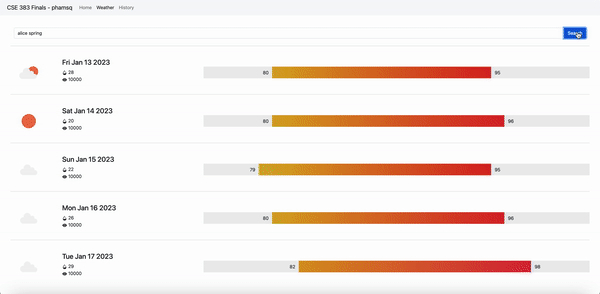
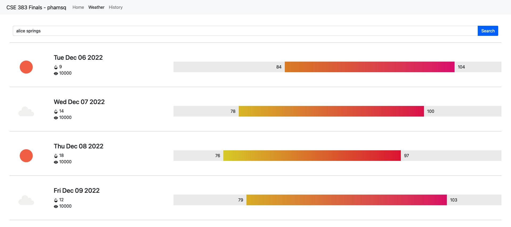
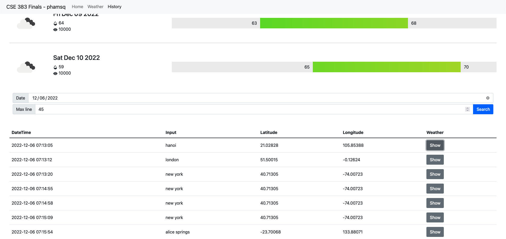

# Color Adaptive Weather Radiant

#### December 4th, 2022, Junior, by Pendleton Pham - @phamsq, for CSE 383 Honors Finals

A color-adapting weather chart based on temperature radiant. Built with Bootstrap HTML, CSS, JS, and PHP

For weather, the API calls TomTom and gather the first result of fuzzy search for the longitude and latitude. JS then pass on the two parameters to OpenWeatherMap to get the next five days’ weather in 3 hour interval, along with pictures for the conditions. JS calculates the min-max temperature, its HSL color coordination, and its relative chart location for the next five days, then bulk-inject HTML code into the website. Finally, JS post the two JSON payloads to the REST server.

The history section is commented out due to REST server on internal network.

For history, the API calls the REST server for the inputted date, and prints out the entire list or the max number of lines, whichever is smaller. Each line has its own unique ID corresponding to the position of display on the list. When the “Show” button is pressed, another API call to the REST server is made, which shows the weather chart and parse only the selected weather.

